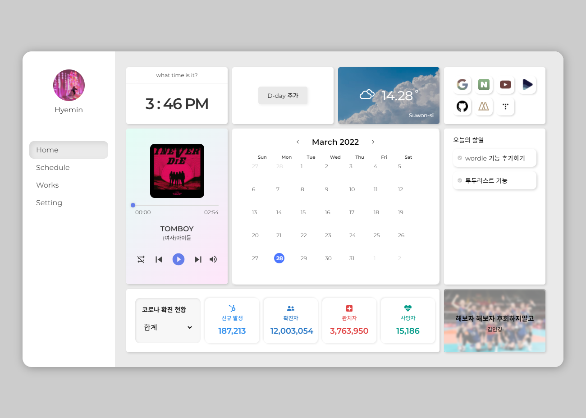
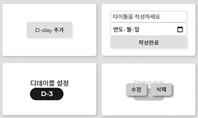
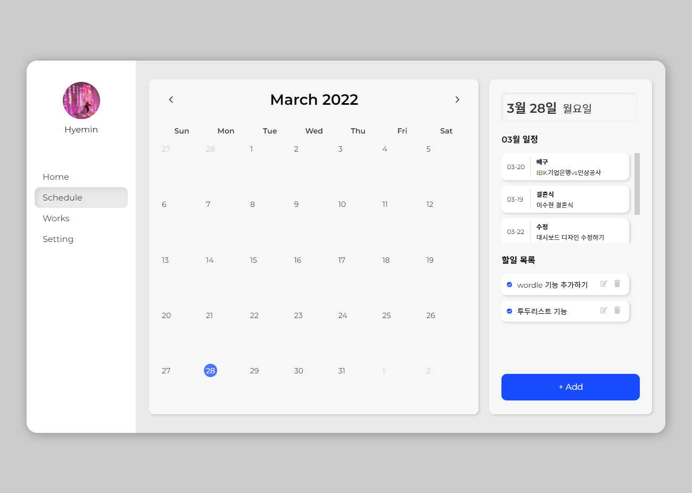
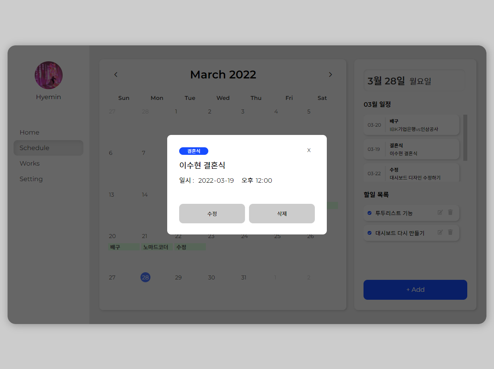
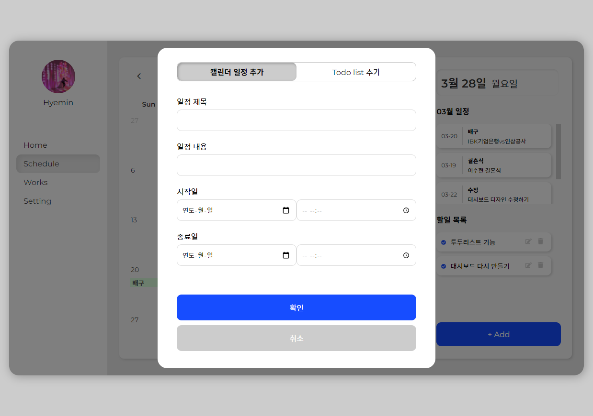
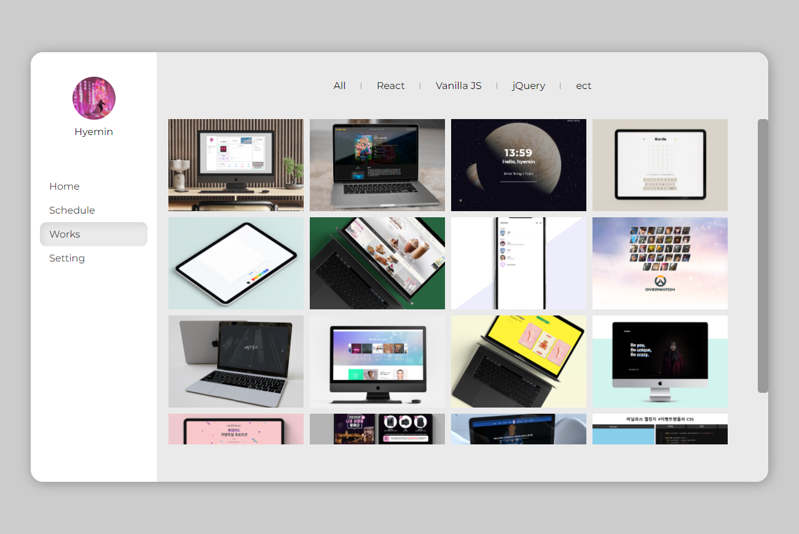
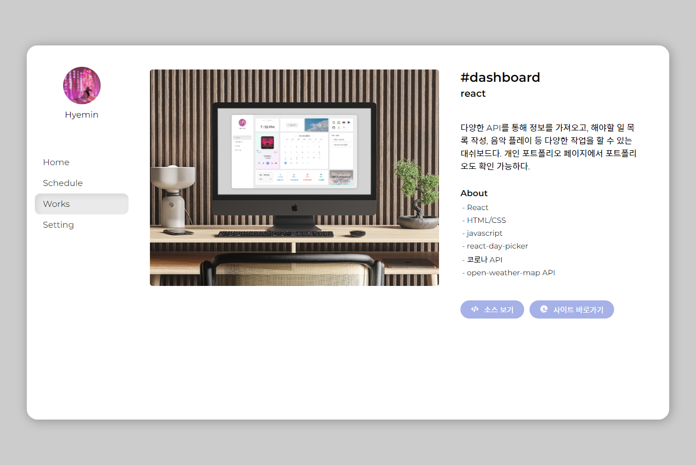
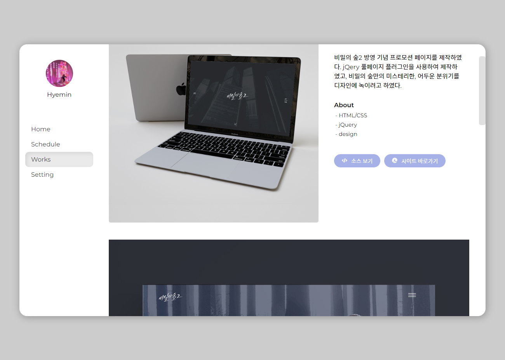
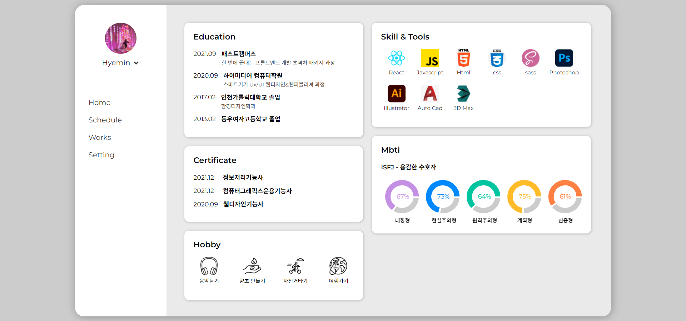

# 대시보드 & 포트폴리오

[](https://lucid-yonath-d614bb.netlify.app)
이미지를 클릭하면 사이트로 이동합니다.

<hr>
<br>

# 페이지 구성

- [Home](#Home)
- [Schedule](#Schedule)
- [work](#Work)
- [about](#About)

<hr>

# #Home



## 01. 현재 시각 Widget

useEffect()를 사용하여 지정된 시간에 새로고침 되도록 작성

```js
const [time, setTime] = useState();
useEffect(() => {
  const timeId = setInterval(() => {
    setTime(new Date());
  }, 30000);
  return () => clearInterval(timeId);
}, []);
```

<hr>

## 02. D-day widget

D-day가 저장되어 있지 않다면 추가할 수 있는 컴포넌트가 나타나며,<br>저장된 D-day가 있다면 해당 D-day의 날짜를 보여주는 컴포넌트가 나타난다.<br>D-day 날짜에 마우스를 호버하면 수정, 삭제할 수 있는 버튼들이 나타난다.
<br>


<hr>

## 03. Weather Widget

사용자의 위치를 허용하면, 경도 위로를 통해 날씨 정보를 가져옴<br>

open-weather-api 사용<br>

요청한 정보의 id 값을 통해 날씨 정보를 data에서 찾아서 출력함

```js
weather: [
    {
      id: 0,
      bgImg:
        "배경이미지",
      icon: <WiDaySunny />,
    },
  /// 중략
    {
      id: 8,
      bgImg:
        "배경이미지",
      icon: <WiCloudy />,
    },
  ],
```

<hr>

## 04. bookmark Widget

자주 사용하는 사이트를 북마크로 저장하여 쉽게 이동할 수 있도록 만든 북마크 위젯

<hr>

## 05. 음악플레이어 Widget

react-h5-audio-player 를 사용하여 음악플레이어를 만듬<br>
해당 노래의 재생이 끝나면 자동으로 다음 노래가 재생된다.

총 3곡의 노래가 저장되어 있음

<hr>

## 06. Calendar Widget

@fullcalendar/react 를 사용하여 달력을 만듬 <br>
해당 일정을 클릭하면 일정을 확인할 수 있으며 수정, 삭제할 수 있다.

<hr>

## 07. todo Widget

아직 완료되지 않은 Todo list가 표시되며, check 버튼을 클릭하면 사라짐

<hr>

## 08. 코로나 확진자 정보 Widget

https://github.com/dhlife09/Corona-19-API<br>
JSON 파일로 제공되는 코로나 19 API 를 사용하여 시.도별 확진자 현황을 출력함<br>
select 박스에서 해당 시도를 클릭하면 확진자 정보에 맞게 변경됨

<hr>

## 09. 명언 Widget

여러개의 명언들이 새로고침될 때마다 랜덤으로 출력됨

<br>
<hr>
<br>

# #Schedule



Home page에 있던 달력을 크게 볼 수 있으며,
해당 월의 일정을 모아서 볼 수 있다.<br>
add 버튼을 누르면, 캘린더 일정과 todo를 추가할 수 있는 modal 창이 나타난다.
<br>
<br>

일정 상세보기


<hr>
일정 및 투두 추가하기


<br>
<hr>
<br>

# #Work



제작한 포트폴리오를 모아둔 페이지.<br>
해당 필터 키워드를 누르면 포트폴리오가 필터링됨<br>
이미지에 마우스를 올리면 해당 포트폴리오의 디테일 페이지로 이동함

<br>

이미지 디테일 페이지


이미지 상세내용이 있는 경우


<br>
<hr>
<br>

# #About



학력, 자격증, 프로그래밍 툴/스킬, 취미 등을 확인할 수 있는 페이지<br>

mbti의 차트는 react-recharts 라이브러리를 활용하여 제작하였다.<br>
기존의 차트를 커스텀하여, 차트 안에 관련 텍스트들을 추가하였다.<br>

https://recharts.org/en-US/examples/PieChartWithPaddingAngle

```js
<div className="pie-chart">
  {chart.map((item, index) => (
    <>
      <PieChart width={85} height={110} key={index}>
        <Pie
          data={item}
          cx={42} // 차트 좌표
          cy={42} // 차트 좌표
          innerRadius={25}
          outerRadius={38}
          fill={colors[index]}
          paddingAngle={5}
          dataKey="value"
        ></Pie>
        {item.map((entry, index) => (
          <Cell key={`cell-${index}`}></Cell> // 차트의 path
        ))}
        // 차트명
        <text
          x={index === 1 || index === 2 ? "26%" : "37%"}
          y={105}
          fill="black"
          fontSize={12}
        >
          {item[0].name}
        </text>
        // 차트 퍼센트
        <text
          x={"41%"}
          y={"47%"}
          fontSize={"14px"}
          fill={colors[index]}
        >{`${item[0].value}%`}</text>
      </PieChart>
    </>
  ))}
</div>
```

<br>
<hr>
<br>

# 라이브러리

## fullcalendar

```
npm i @fullcalendar/daygrid fullcalendar/interaction @fullcalendar/react
```

fullcalendar/interaction 를 설치해야 클릭 이벤트를 실행할 수 있음
<br>
설치하고, <FullCalendar />를 가져와서 사용

```js
import FullCalendar from "@fullcalendar/react"; // must go before plugins
import dayGridPlugin from "@fullcalendar/daygrid"; // a plugin!
import interactionPlugin from "@fullcalendar/interaction";

function Calendar() {
  const events = useSelector((state) => state.eventsReducer);
  const [event, setEvent] = useState();
  function handleDateClick(e) {
    setEvent(e.event._def);
    setEModal(!eModal);
  }
  return (
    <div className="calendar-wrapper">
      <div className="fullcalendar">
        <FullCalendar
          nowIndicator
          plugins={[dayGridPlugin, interactionPlugin]}
          initialView="dayGridMonth"
          headerToolbar={{ left: "prev", center: "title", right: "next" }}
          contentHeight={"300px"}
          fixedWeekCount={false}
          expandRows={true}
          eventBackgroundColor={"#d9fcdb"}
          eventBorderColor={"#F578Dc"}
          events={events}
          eventClick={handleDateClick}
          // 이벤트 업데이트 eventsDidUpdate={("updateEvent", events)}
        />
      </div>
    </div>
  );
}
export default Calendar;
```
